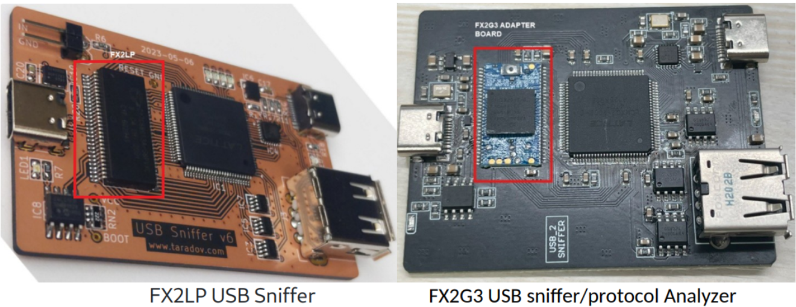
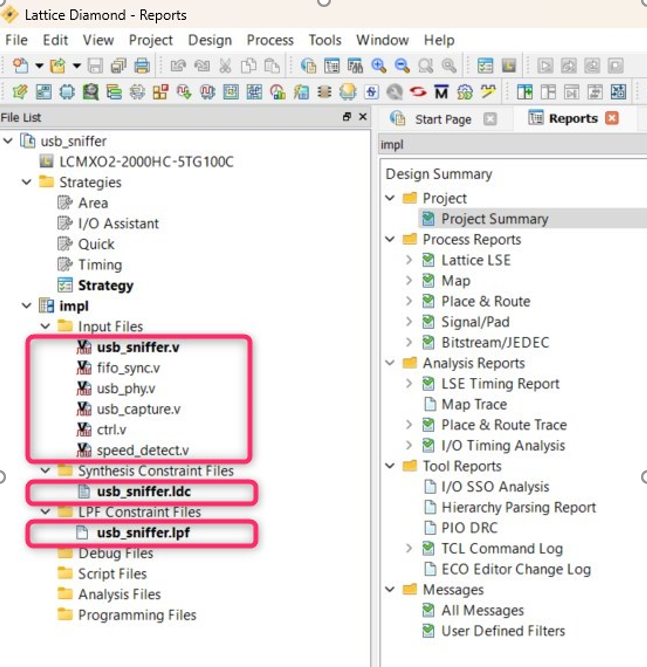
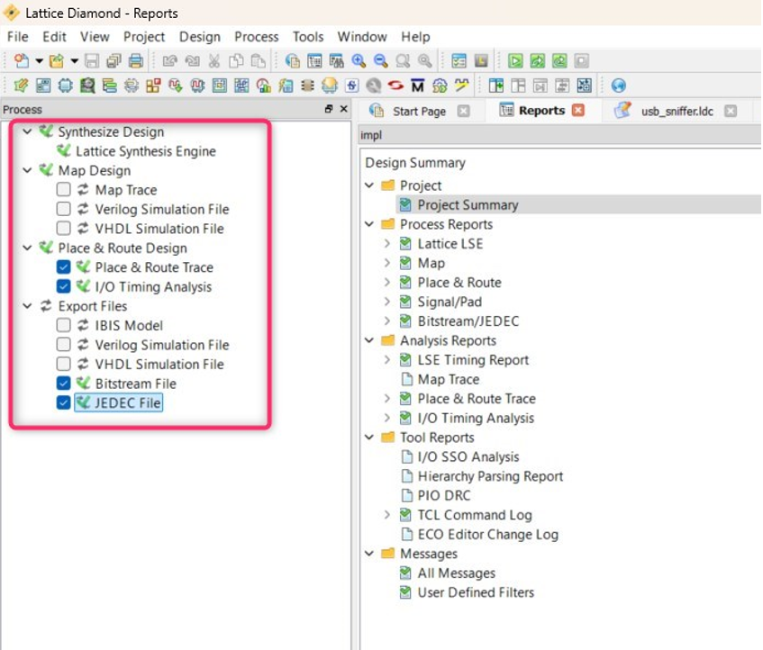
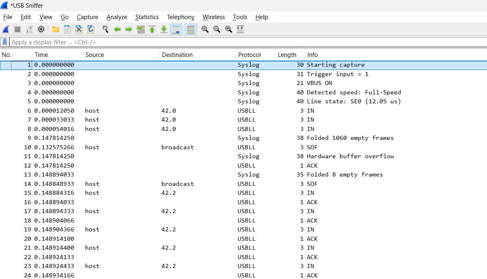
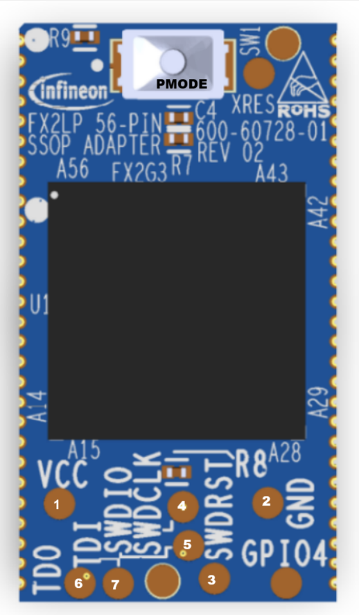

# EZ-USB&trade; FX2G3: Protocol analyzer/USB sniffer application

This code example demostrates an application designed to capture and forward USB packets to a host. It runs on custom hardware and can communicate with Wireshark. This code example explains the configuration and usage of sensor interface port (SIP) on the EZ-USB&trade; FX2G3 device to implement the synchronous slave FIFO IN protocol. The EZ-USB&trade; FX2G3 device is configured as the master and the Lattice FPGA as the slave.

[View this README on GitHub.](https://github.com/Infineon/mtb-example-fx2g3-protocol-analyzer)

[Provide feedback on this code example.](https://cypress.co1.qualtrics.com/jfe/form/SV_1NTns53sK2yiljn?Q_EED=eyJVbmlxdWUgRG9jIElkIjoiQ0UyNDEwNzAiLCJTcGVjIE51bWJlciI6IjAwMi00MTA3MCIsIkRvYyBUaXRsZSI6IkVaLVVTQiZ0cmFkZTsgRlgyRzM6IFByb3RvY29sIGFuYWx5emVyL1VTQiBzbmlmZmVyIGFwcGxpY2F0aW9uIiwicmlkIjoic3VrdSIsIkRvYyB2ZXJzaW9uIjoiMS4wLjAiLCJEb2MgTGFuZ3VhZ2UiOiJFbmdsaXNoIiwiRG9jIERpdmlzaW9uIjoiTUNEIiwiRG9jIEJVIjoiV0lSRUQiLCJEb2MgRmFtaWx5IjoiSFNMU19VU0IifQ==)


## Requirements


- [ModusToolbox&trade;](https://www.infineon.com/modustoolbox) v3.5 or later (tested with v3.5)
- Board support package (BSP) minimum required version: 4.3.3
- Programming language: C
- Associated parts: [EZ-USB&trade; FX2G3](https://www.infineon.com/cms/en/product/promopages/ez-usb-fx2g3/)


## Supported toolchains (make variable 'TOOLCHAIN')

- GNU Arm&reg; Embedded Compiler v14.2.1 (`GCC_ARM`) – Default value of `TOOLCHAIN`
- Arm&reg; Compiler v6.22 (`ARM`)


## Supported kits (make variable 'TARGET')

- [EZ-USB&trade; FX2G3 DVK](https://www.infineon.com/cms/en/product/promopages/ez-usb-fx2g3/) (`KIT_FX2G3_104LGA`) – Default value of `TARGET`


## Hardware setup

This example uses a low-cost USB sniffer available at [usb-sniffer](https://github.com/ataradov/usb-sniffer), with the EZ-USB&trade; FX2LP replaced by the EZ-USB&trade; FX2G3 adapter board.

   **Figure 1. USB sniffer hardware with EZ-USB&trade; FX2LP and EZ-USB&trade; FX2G3 devices**

   


## Software setup

See the [ModusToolbox&trade; tools package installation guide](https://www.infineon.com/ModusToolboxInstallguide) for information about installing and configuring the tools package.

Install a terminal emulator if you do not have one. Instructions in this document use [Tera Term](https://teratermproject.github.io/index-en.html).

- Install the [Wireshark application](https://www.wireshark.org/download.html) and configure the plugin described in [usb-sniffer](https://github.com/ataradov/usb-sniffer?tab=readme-ov-file#installation). See the [Sniffer-Wireshark interface configuration](#sniffer-wireshark-interface-configuration) section for setting up the plugin to recognize the EZ-USB&trade; FX2G3 sniffer device.

  See the [Lattice FPGA configuration](#lattice-fpga-configuration) section for setting up the required software and configuring the on-board Lattice FPGA

- Install the **EZ-USB&trade; FX Control Center** (Alpha) application from [Infineon Developer Center](https://softwaretools.infineon.com/tools/com.ifx.tb.tool.ezusbfxcontrolcenter)


## Using the code example


### Create the project

The ModusToolbox&trade; tools package provides the Project Creator as both a GUI tool and a command line tool.

<details><summary><b>Use Project Creator GUI</b></summary>

1. Open the Project Creator GUI tool

   There are several ways to do this, including launching it from the dashboard or from inside the Eclipse IDE. For more details, see the [Project Creator user guide](https://www.infineon.com/ModusToolboxProjectCreator) (locally available at *{ModusToolbox&trade; install directory}/tools_{version}/project-creator/docs/project-creator.pdf*)

2. On the **Choose Board Support Package (BSP)** page, select a kit supported by this code example. See [Supported kits](#supported-kits-make-variable-target)

   > **Note:** To use this code example for a kit not listed here, you may need to update the source files. If the kit does not have the required resources, the application may not work

3. On the **Select Application** page:

   a. Select the **Applications(s) Root Path** and the **Target IDE**

   > **Note:** Depending on how you open the Project Creator tool, these fields may be pre-selected for you

   b. Select this code example from the list by enabling its check box

   > **Note:** You can narrow the list of displayed examples by typing in the filter box

   c. (Optional) Change the suggested **New Application Name** and **New BSP Name**

   d. Click **Create** to complete the application creation process

</details>


<details><summary><b>Use Project Creator CLI</b></summary>

The 'project-creator-cli' tool can be used to create applications from a CLI terminal or from within batch files or shell scripts. This tool is available in the *{ModusToolbox&trade; install directory}/tools_{version}/project-creator/* directory.

Use a CLI terminal to invoke the 'project-creator-cli' tool. On Windows, use the command-line 'modus-shell' program provided in the ModusToolbox&trade; installation instead of a standard Windows command-line application. This shell provides access to all ModusToolbox&trade; tools. You can access it by typing "modus-shell" in the search box in the Windows menu. In Linux and macOS, you can use any terminal application.

The following example clones the "[mtb-example-fx2g3-protocol-analyzer](https://github.com/Infineon/mtb-example-fx2g3-protocol-analyzer)" application with the desired name "FX2G3_Protocol_Analyzer" configured for the *KIT_FX2G3_104LGA* BSP into the specified working directory, *C:/mtb_projects*:

   ```
   project-creator-cli --board-id KIT_FX2G3_104LGA --app-id mtb-example-fx2g3-protocol-analyzer --user-app-name FX2G3_Protocol_Analyzer --target-dir "C:/mtb_projects"
   ```

The 'project-creator-cli' tool has the following arguments:

Argument | Description | Required/optional
---------|-------------|-----------
`--board-id` | Defined in the <id> field of the [BSP](https://github.com/Infineon?q=bsp-manifest&type=&language=&sort=) manifest | Required
`--app-id`   | Defined in the <id> field of the [CE](https://github.com/Infineon?q=ce-manifest&type=&language=&sort=) manifest | Required
`--target-dir`| Specify the directory in which the application is to be created if you prefer not to use the default current working directory | Optional
`--user-app-name`| Specify the name of the application if you prefer to have a name other than the example's default name | Optional

<br>

> **Note:** The project-creator-cli tool uses the `git clone` and `make getlibs` commands to fetch the repository and import the required libraries. For details, see the "Project creator tools" section of the [ModusToolbox&trade; tools package user guide](https://www.infineon.com/ModusToolboxUserGuide) (locally available at {ModusToolbox&trade; install directory}/docs_{version}/mtb_user_guide.pdf).

</details>


### Open the project

After the project has been created, you can open it in your preferred development environment.


<details><summary><b>Eclipse IDE</b></summary>

If you opened the Project Creator tool from the included Eclipse IDE, the project will open in Eclipse automatically.

For more details, see the [Eclipse IDE for ModusToolbox&trade; user guide](https://www.infineon.com/MTBEclipseIDEUserGuide) (locally available at *{ModusToolbox&trade; install directory}/docs_{version}/mt_ide_user_guide.pdf*).

</details>


<details><summary><b>Visual Studio (VS) Code</b></summary>

Launch VS Code manually, and then open the generated *{project-name}.code-workspace* file located in the project directory.

For more details, see the [Visual Studio Code for ModusToolbox&trade; user guide](https://www.infineon.com/MTBVSCodeUserGuide) (locally available at *{ModusToolbox&trade; install directory}/docs_{version}/mt_vscode_user_guide.pdf*).

</details>


<details><summary><b>Command line</b></summary>

If you prefer to use the CLI, open the appropriate terminal, and navigate to the project directory. On Windows, use the command-line 'modus-shell' program; on Linux and macOS, you can use any terminal application. From there, you can run various `make` commands.

For more details, see the [ModusToolbox&trade; tools package user guide](https://www.infineon.com/ModusToolboxUserGuide) (locally available at *{ModusToolbox&trade; install directory}/docs_{version}/mtb_user_guide.pdf*).

</details>


### Lattice FPGA configuration

Download or clone the [USB Sniffer](https://github.com/ataradov/usb-sniffer) GitHub repository into a local directory.

Navigate to the Lattice FPGA project available in the [FPGA directory](https://github.com/ataradov/usb-sniffer/tree/main/fpga) of the [USB Sniffer](https://github.com/ataradov/usb-sniffer) project root.


#### Configure EZ-USB&trade; FX2G3 and EZ-USB&trade; FPGA pin mapping

For this code example, perform the following pin map changes for the EZ-USB&trade; FX2G3 adapter board rev1.0, specified in the *.lpf* file:

Targeted lines before edit                   | Targeted lines after edit
:-------                                     | :-------
LOCATE COMP "slrd_o" SITE "48";<br>LOCATE COMP "slwr_o" SITE "49";<br>LOCATE COMP "sloe_o" SITE "69";<br>LOCATE COMP "pktend_o" SITE "64";<br>LOCATE COMP "flaga_i" SITE "78";<br>LOCATE COMP "flagb_i" SITE "75";<br>LOCATE COMP "flagc_i" SITE "74";<br>LOCATE COMP "fifoaddr_o[0]" SITE "67";<br>LOCATE COMP "fifoaddr_o[1]" SITE "65";<br>   | LOCATE COMP "slrd_o" SITE "67";<br>LOCATE COMP "slwr_o" SITE "49";<br>LOCATE COMP "sloe_o" SITE "48";<br>LOCATE COMP "pktend_o" SITE "65";<br>LOCATE COMP "flaga_i" SITE "78";<br>LOCATE COMP "flagb_i" SITE "75";<br>LOCATE COMP "fifoaddr_o[0]" SITE "74";<br>LOCATE COMP "fifoaddr_o[1]" SITE "63";


#### Build the FPGA binary

Perform the following steps after the pin map configuration to build the new *.jed* binary:

1. Download and install the [Lattice Diamond](https://www.latticesemi.com/LatticeDiamond) tool. Get the license supporting the LCMXO2-2000HC-5TG100C FPGA part by contacting Lattice support

2. Launch the Lattice Diamond tool, go to **File** > **Open**, browse the project directory, and select the corresponding project file with the *.ldf* extension. Ensure all the source (*.v*) files and constraint (*.ldc*, *.lpf*) files are loaded in the **File List** tab

   **Figure 2. Lattice project explorer**

   

4. Click the **Process** tab and select the checkboxes associated with the following options:

   a. **Place & Route Trace**<br>
   b. **I/O Timing Analysis**<br>
   c. **Bitstream File**<br>
   d. **JEDEC File**<br>
	

5. Click **Export Files** to generate the final JEDEC File required for programming. After the JEDEC file is generated, observe the tick mark symbol beside the **Export Files** option

   **Figure 3. Building a Lattice project**

   


#### Flash the FPGA binary

Perform the following steps to program the FPGA binary file onto the external flash:

1. Connect the USB sniffer to the host

2. Open a command line interface terminal (such as command prompt)

3. Copy the generated *.jed* file into bin directory

4. Navigate to the bin directory and run the following command:

    ```sh
    usb_sniffer_win --fpga-flash usb_sniffer_impl_fx2g3.jed
    ```

5. Check the programming status. If failed, replace the device. Once the FPGA binary programming is successful, power cycle the device and program the firmware using the EZ-USB&trade; FX Control Center application

**Table 1. Bitfile description**

BitFile                         |    Description   
:--------------------           | :----------------                
*usb_sniffer_impl_fx2g3.jed*    | Lattice FPGA bin file with the modified pin map

<br>


### Sniffer-Wireshark interface configuration

1. Navigate to the [software](https://github.com/ataradov/usb-sniffer/tree/main/software) directory in the local clone of the [USB Sniffer](https://github.com/ataradov/usb-sniffer) project

2. Rebuild the open source software with PID=`0x4908` and VID=`0x04B4` by changing the `FX2LP_PID` and `FX2LP_VID` macros in the [*usb_sniffer.c*](https://github.com/ataradov/usb-sniffer/blob/main/software/usb_sniffer.c) file


### Using this code example with specific products

This code example is only supported on the `CYUSB2318-BF104AXI` product.

## Operation

**Note:** This code example currently supports Windows hosts. Support for Linux and macOS will be added in upcoming releases.

1. Connect the board (J2) to your PC using the provided USB cable

2. Connect the UART DEBUG (Tx pin) for debug logs

3. Open a terminal program and select the Serial COM port. Set the serial port parameters to 8N1 and 921600 baud

4. Follow these steps to program the board using the [**EZ-USB&trade; FX Control Center**](https://softwaretools.infineon.com/tools/com.ifx.tb.tool.ezusbfxcontrolcenter) (Alpha) application

   1. Perform the following steps to enter into the **Bootloader** mode:

      a. Press and hold the **PMODE** (**SW1**) switch<br>
      b. Press and release the **RESET** switch<br>
      c. Release the **PMODE** switch<br>

   2. Open **EZ-USB&trade; FX Control Center** application
      The **EZ-USB&trade; FX2G3** device displays as **EZ-USB&trade; FX BOOTLOADER**

   3. Select the **EZ-USB&trade; FX BOOTLOADER** device in **EZ-USB&trade; FX Control Center** 

   4. Navigate to **Program** > **Internal Flash**

   5. Navigate to the *<CE Title>/build/APP_KIT_FX2G3_104LGA/Release* folder within the CE directory and locate the *.hex* file and program
      
   6. Confirm if the programming is successful in the log window of the **EZ-USB&trade; FX Control Center** application
   
5. After programming, the application starts automatically. Confirm that the following title is displayed on the UART terminal:

   **Figure 1. Terminal output on program startup**

   

6. Plug in both the USB Type-C ports into the host. Connect a USB Mouse Low Speed device to the Type-A port. Configure a Wireshark plugin to capture a Low Speed device. Save the settings and start capturing

   **Figure 5. Wireshark output for USB Mouse Low Speed device**

   

   
## Debugging

You can debug the example to step through the code.


<details><summary><b>In Eclipse IDE</b></summary>

Use the **\<Application Name> Debug (KitProg3_MiniProg4)** configuration in the **Quick Panel**. For details, see the "Program and debug" section in the [Eclipse IDE for ModusToolbox&trade; user guide](https://www.infineon.com/MTBEclipseIDEUserGuide).

</details>


<details><summary><b>In other IDEs</b></summary>

Follow the instructions in your preferred IDE.
</details>


### Log messages

By default, the USBFS port is enabled for debug logs.

To enable debug logs on UART, set the **USBFS_LOGS_ENABLE** compiler flag to '0u' in the *Makefile* file. SCB4 of the EZ-USB&trade; FX2G3 device is used as UART with a baud rate of 921,600 to send out log messages through the P11.0 pin.

Debug the code example by setting debug levels for the UART logs. Set the `DEBUG_LEVEL` macro in the *main.c* file with the following values for debugging:

**Table 2. Debug values**

 Macro value  | Description
 :--------    | :-------------
 1u           | Enable only error messages
 2u           | Enable error and warning messages
 3u           | Enable error, warning, and info messages
 4u           | Enable all message types
<br>


## Design and implementation

### Features of the application

- **USB specifications:** USB 2.0 (both Hi-Speed and Full-Speed)
- Supports write operation initiated by the FPGA/master device
- Supports write on both the GPIF threads, i.e., GPIF thread '0' and GPIF thread '1'


### Data streaming path

- The device enumerates as a vendor-specific USB device with one BULK endpoint (2-IN)
   
- The application enables one BULK, i.e., EP 2-IN with a maximum packet size of 512 bytes

- The device receives the data through the following datapath:
  - **Datapath #1:** Data is received on LVCMOS Socket 0 (mapped to GPIF thread 0) and sent to EP 2-IN

- Four DMA buffers sized 61440 bytes each are used in holding and forwarding the data to the USB


### Limitations

By default, only `BUS_WIDTH_16` is enabled and the 8-bit mode is not supported. 


### Application workflow

   The application flow involves three main steps:

   - Initialization 
   - USB device enumeration
   - Data transfers


#### Initialization

During initialization, the following steps are performed:

1. All required data structures are initialized

2. USBD and USB driver (CAL) layers are initialized

3. The application registers all descriptors supported by the function/application with the USBD layer

4. Application registers callback functions for different events, such as `RESET`, `SUSPEND`, `RESUME`, `SET_CONFIGURATION`, `SET_INTERFACE`, `SET_FEATURE`, and `CLEAR_FEATURE`. USBD calls the respective callback function when the corresponding events are detected

5. The data transfer state machines are initialized

6. The application registers handlers for all relevant interrupts

7. The application makes the USB device visible to the host by calling the Connect API

8. FPGA is initialized or configured using I2C bitbang writes

9. The application initializes the SIP block on the EZ-USB&trade; FX2G3 device as required by the selected LVCMOS operating mode


#### USB device enumeration

1. During USB device enumeration, the host requests for descriptors that are already registered with the USBD layer during the initialization phase

2. The host sends the `SET_CONFIGURATION` and `SET_INTERFACE` commands to activate the required function in the device

3. After the `SET_CONFIGURATION` and `SET_INTERFACE` commands, the application task takes control and enables the endpoints for data transfer


#### Master FIFO IN transfer

1. The FPGA writes data onto the databus

2. A GPIF state machine samples this data and commits the short packets. The High BandWidth DMA channel is used to copy the data from the LVCMOS IP into the DMA buffer RAM and DataWire channel to move the data to the USBHS Endpoint Memory

3. The produce event callbacks from the High BandWidth DMA channel are used to enable DataWire transfers to the USBHS endpoints

4. Once the DataWire transfer completion interrupt is received, the High BandWidth DMA buffers are marked free by calling `Cy_HBDma_Channel_DiscardBuffer()`

**Table 3. Control signal usage in LVCMOS master FIFO state machine**

EZ-USB&trade; FX2G3 pin   | Function  | Description
:--------                 | :-------  | :----------
P0CTL0                    | SLCS#     | Active low and is connected to GND
P0CTL1                    | SLWR#     | Active high write enable signal. Should be asserted (high) by the FPGA when sending any data to the EZ-USB&trade; FX2G3 device
P0CTL2                    | SLOE#     | Active high output enable signal
P0CTL3                    | SLRD#     | Active high read enable signal. Not used in this application as data is only being received by EZ-USB&trade; FX2G3 device
P0CTL4                    | PKTEND#   | Active high packet end signal. Should be asserted (high) when the FPGA wants to terminate the ongoing DMA transfer
P0CTL5                    | FlagA     | Active high DMA ready indication for currently addressed/active thread
P0CTL6                    | FlagB     | Active high DMA water mark (full/not full) indication for currently addressed or active thread
P0CTL7                    | FlagC     | This signal is not used
P0CTL9                    | A0        | LS bit of 2-bit address bus used to select thread
P0CTL8                    | A1        | MS bit of 2-bit address bus used to select thread


## Compile-time configurations

This application's functionality can be customized by setting variables in *Makefile* or by configuring them through `make` CLI arguments.

- Run the `make build` command or build the project in your IDE to compile the application and generate a USB bootloader-compatible binary. This binary can be programmed onto the EZ-USB&trade; FX2G3 device using the **EZ-USB&trade; FX Control Center** application

- Run the `make build CORE=CM0P` command or set the variable in *Makefile* to compile and generate the binary for the Cortex&reg; M0+ core. By default, `CORE` is set as `CM4` and the binary is compiled and generated for the Cortex&reg; M4 core

- Choose between the **Arm&reg; Compiler** or the **GNU Arm&reg; Embedded Compiler** build toolchains by setting the `TOOLCHAIN` variable in *Makefile* to `ARM` or `GCC_ARM` respectively. If you set it to `ARM`, ensure to set `CY_ARM_COMPILER_DIR` as a make variable or environment variable, pointing to the path of the compiler's root directory

By default, the application is configured to receive data from a 16-bit wide LVCMOS interface in SDR mode and make a USBHS data connection. Additional settings can be configured through macros specified by the `DEFINES` variable in *Makefile*:

**Table 4. Macro description**

Flag name         | Description                               | Allowed values
:-------------    | :------------                             | :--------------
BUS_WIDTH_16      | Select the LVCMOS bus width               | "1u" for 16-bit <br> "0u" for 8-bit bus width
USBFS_LOGS_ENABLE | Enable debug logs through the USBFS port  | 1u for debug logs over USBFS <br> 0u for debug logs over UART (SCB4)
<br>


## SWD interface

The EZ-USB&trade; FX2G3 device can be programmed through the SWD interface using the OpenOCD tool. On the EZ-USB&trade; FX2G3 adapter board, solder the VCC, GND, SWDRST, SWDCLK, and SWDIO pins.

**Figure 6. EZ-USB&trade; FX2G3 adapter board**



**Table 5. SWD pinout description**

Label    | Description
:----    | :----------
1        | VCC or VTARG
2        | GND
3        | SWDRST or XRES
4        | SWDCLK
5        | SWDIO
6        | TDO or Tx for debug prints
7        | TDI
<br>


## Application files

**Table 6. Application file description**

File                                | Description   
:-------------                      | :------------                         
*gpif_header.h*              	    | Generated header file for GPIF state configuration for LVCMOS interface
*usb_app.c*                         | C source file implementing Protocol analyzer/USB sniffer application logic
*usb_app.h*                         | Header file for application data structure and function declarations
*usb_descriptors.c*                 | C source file containing the USB descriptors
*main.c*                            | Source file for device initialization, ISRs, and LVCMOS interface initialization, etc.
*usb_i2c.c*                         | C source file with I2C handlers
*usb_i2c.h*                         | Header file with the I2C application constants and function definitions
*cm0_code.c*                        | CM0 initialization code
*Makefile*                          | GNU make compliant build script for compiling this example
<br>


## Related resources

Resources  | Links
-----------|----------------------------------
User guide | [EZ-USB&trade; FX2G3 SDK user guide](./docs/EZ-USB-FX2G3-SDK-User-Guide.pdf)
Code examples  | [Using ModusToolbox&trade;](https://github.com/Infineon/Code-Examples-for-ModusToolbox-Software) on GitHub
Device documentation | [EZ-USB&trade; FX2G3 datasheets](https://www.infineon.com/cms/en/product/promopages/ez-usb-fx2g3/#!?fileId=8ac78c8c90530b3a01909c03f29537e0)
Development kits | Select your kits from the [Evaluation board finder](https://www.infineon.com/cms/en/design-support/finder-selection-tools/product-finder/evaluation-board)
Libraries on GitHub | [mtb-pdl-cat1](https://github.com/Infineon/mtb-pdl-cat1) – Peripheral Driver Library (PDL) and documents
Middleware on GitHub  | [usbfxstack](https://github.com/Infineon/usbfxstack) – USBFXStack middleware library and documents
Tools  | [ModusToolbox&trade;](https://www.infineon.com/modustoolbox) – ModusToolbox&trade; software is a collection of easy-to-use libraries and tools enabling rapid development with Infineon MCUs for applications ranging from wireless and cloud-connected systems, edge AI/ML, embedded sense and control, to wired USB connectivity using PSOC&trade; Industrial/IoT MCUs, AIROC&trade; Wi-Fi and Bluetooth&reg; connectivity devices, XMC&trade; Industrial MCUs, and EZ-USB&trade;/EZ-PD&trade; wired connectivity controllers. ModusToolbox&trade; incorporates a comprehensive set of BSPs, HAL, libraries, configuration tools, and provides support for industry-standard IDEs to fast-track your embedded application development
<br>

### Compatibility information:
* This code example uses the PDL layer for direct communication with device peripherals, without relying on HAL peripheral APIs
* This code example relies on the USBFXStack middleware library for USBFS and does not support USBFS through the USB Device Middleware Library


## Other resources

Infineon provides a wealth of data at [www.infineon.com](https://www.infineon.com) to help you select the right device, and quickly and effectively integrate it into your design.


## Document history


Document title: *CE241070* – *EZ-USB&trade; FX2G3: Protocol analyzer/USB sniffer application*

 Version | Description of change
 ------- | ---------------------
 1.0.0   | New code example
<br>


All referenced product or service names and trademarks are the property of their respective owners.

The Bluetooth&reg; word mark and logos are registered trademarks owned by Bluetooth SIG, Inc., and any use of such marks by Infineon is under license.

PSOC&trade;, formerly known as PSoC&trade;, is a trademark of Infineon Technologies. Any references to PSoC&trade; in this document or others shall be deemed to refer to PSOC&trade;.

---------------------------------------------------------

© Cypress Semiconductor Corporation, 2025. This document is the property of Cypress Semiconductor Corporation, an Infineon Technologies company, and its affiliates ("Cypress").  This document, including any software or firmware included or referenced in this document ("Software"), is owned by Cypress under the intellectual property laws and treaties of the United States and other countries worldwide.  Cypress reserves all rights under such laws and treaties and does not, except as specifically stated in this paragraph, grant any license under its patents, copyrights, trademarks, or other intellectual property rights.  If the Software is not accompanied by a license agreement and you do not otherwise have a written agreement with Cypress governing the use of the Software, then Cypress hereby grants you a personal, non-exclusive, nontransferable license (without the right to sublicense) (1) under its copyright rights in the Software (a) for Software provided in source code form, to modify and reproduce the Software solely for use with Cypress hardware products, only internally within your organization, and (b) to distribute the Software in binary code form externally to end users (either directly or indirectly through resellers and distributors), solely for use on Cypress hardware product units, and (2) under those claims of Cypress's patents that are infringed by the Software (as provided by Cypress, unmodified) to make, use, distribute, and import the Software solely for use with Cypress hardware products.  Any other use, reproduction, modification, translation, or compilation of the Software is prohibited.
<br>
TO THE EXTENT PERMITTED BY APPLICABLE LAW, CYPRESS MAKES NO WARRANTY OF ANY KIND, EXPRESS OR IMPLIED, WITH REGARD TO THIS DOCUMENT OR ANY SOFTWARE OR ACCOMPANYING HARDWARE, INCLUDING, BUT NOT LIMITED TO, THE IMPLIED WARRANTIES OF MERCHANTABILITY AND FITNESS FOR A PARTICULAR PURPOSE.  No computing device can be absolutely secure.  Therefore, despite security measures implemented in Cypress hardware or software products, Cypress shall have no liability arising out of any security breach, such as unauthorized access to or use of a Cypress product. CYPRESS DOES NOT REPRESENT, WARRANT, OR GUARANTEE THAT CYPRESS PRODUCTS, OR SYSTEMS CREATED USING CYPRESS PRODUCTS, WILL BE FREE FROM CORRUPTION, ATTACK, VIRUSES, INTERFERENCE, HACKING, DATA LOSS OR THEFT, OR OTHER SECURITY INTRUSION (collectively, "Security Breach").  Cypress disclaims any liability relating to any Security Breach, and you shall and hereby do release Cypress from any claim, damage, or other liability arising from any Security Breach.  In addition, the products described in these materials may contain design defects or errors known as errata which may cause the product to deviate from published specifications. To the extent permitted by applicable law, Cypress reserves the right to make changes to this document without further notice. Cypress does not assume any liability arising out of the application or use of any product or circuit described in this document. Any information provided in this document, including any sample design information or programming code, is provided only for reference purposes.  It is the responsibility of the user of this document to properly design, program, and test the functionality and safety of any application made of this information and any resulting product.  "High-Risk Device" means any device or system whose failure could cause personal injury, death, or property damage.  Examples of High-Risk Devices are weapons, nuclear installations, surgical implants, and other medical devices.  "Critical Component" means any component of a High-Risk Device whose failure to perform can be reasonably expected to cause, directly or indirectly, the failure of the High-Risk Device, or to affect its safety or effectiveness.  Cypress is not liable, in whole or in part, and you shall and hereby do release Cypress from any claim, damage, or other liability arising from any use of a Cypress product as a Critical Component in a High-Risk Device. You shall indemnify and hold Cypress, including its affiliates, and its directors, officers, employees, agents, distributors, and assigns harmless from and against all claims, costs, damages, and expenses, arising out of any claim, including claims for product liability, personal injury or death, or property damage arising from any use of a Cypress product as a Critical Component in a High-Risk Device. Cypress products are not intended or authorized for use as a Critical Component in any High-Risk Device except to the limited extent that (i) Cypress's published data sheet for the product explicitly states Cypress has qualified the product for use in a specific High-Risk Device, or (ii) Cypress has given you advance written authorization to use the product as a Critical Component in the specific High-Risk Device and you have signed a separate indemnification agreement.
<br>
Cypress, the Cypress logo, and combinations thereof, ModusToolbox, PSoC, CAPSENSE, EZ-USB, F-RAM, and TRAVEO are trademarks or registered trademarks of Cypress or a subsidiary of Cypress in the United States or in other countries. For a more complete list of Cypress trademarks, visit www.infineon.com. Other names and brands may be claimed as property of their respective owners.
